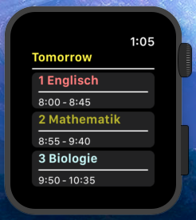
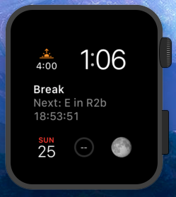

# Deprecated: I rewrote the complete project in this repo: [Project S.I.T.N.U](https://github.com/TheNoim/project-sitnu)

The new repo even includes an TestFlight link. So you don't need to compile the new project by yourself. Maybe I will even at some point submit it to the AppStore. The new project is much faster and more reliable. 

# WebUntis on Apple Watch ⌚

This Client is based on my own [WebUntis Swift Framework](https://github.com/TheNoim/WebUntis-Swift). 

I will probably not publish this app on the app store, but if you want to use it, you can compile it your self and use it. 

 

## Features

- Complication Support with Lesson Countdown
- Background Refresh
- Apple Watch App
- Support for every school using WebUntis

## Bugs/Feature Requests

If you find any Bug with this App, write an Issue in this GitHub Repo. 

Make sure to give enough information. A simple: `It does not work` doesen't help anybody.
